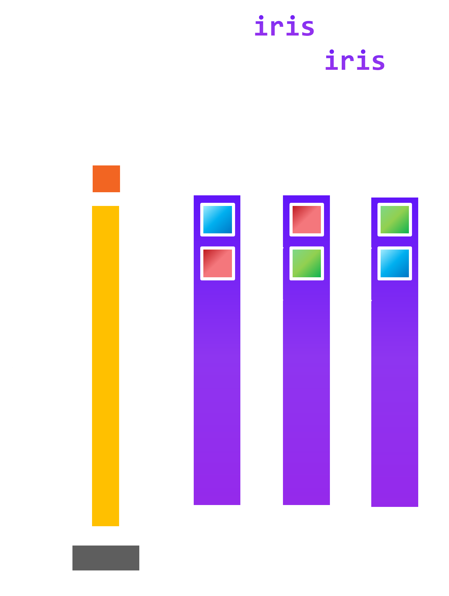
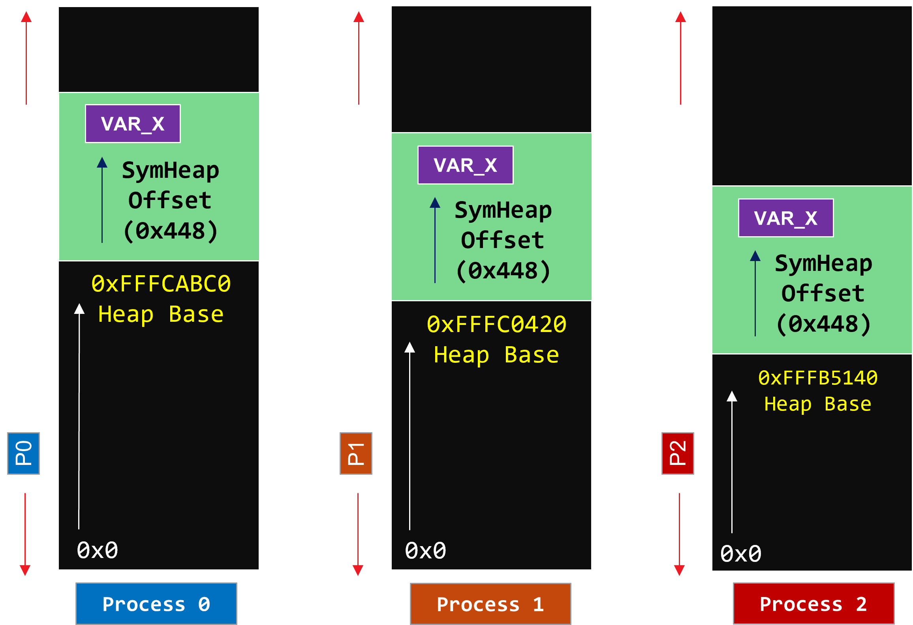

<!--
SPDX-License-Identifier: MIT
Copyright (c) 2025 Advanced Micro Devices, Inc. All rights reserved.
-->

**[README](../README.md)** » **Programming Model**

# Programming Model

<div style="overflow: hidden;">
  <p style="float: left; width: 50%;">
    Iris is an open-source triton-based framework for Remote Memory Access (RMA[^1]) operations written in only a few 100 lines of code. Iris provides SHMEM-like APIs within Triton for Multi-GPU programming.
  </p>
  <picture>
    <source media="(prefers-color-scheme: dark)" srcset="../images/iris-model.png">
    <source media="(prefers-color-scheme: light)" srcset="../images/iris-model-light.png">
    
  </picture>
</div>

1. **Designed by Experts, Built for Scale**
    - Written from scratch by GPU and distributed computing experts
    - Minimal dependencies: only Triton, PyTorch, HIP runtime and mpi4py (for initialization)
    - No external frameworks or heavyweight runtimes beyond core stack

2. **Clean Abstractions**
    - Full Symmetric Heap implementation in Python
    - Pythonic PyTorch-like host APIs for tensor allocation and construction
    - Pythonic Triton-style device APIs for load, store, and atomic ops

3. **Communication + Computation**
    - Device-side collective ops: broadcast, scatter, reduce, etc.
    - Lock variants for communication and computation overlap
    - Fine-grained GEMM + communication overlap via workgroup specialization

4. **Scalable by Design**
    - Full scale-up (multi-GPU node) support
    - Scale-out (multi-node) in progress

[^1]: Remote Direct Memory Access (RDMA) is work-in-progress.

## Simple `load` & `store` APIs

```python
@triton.jit
def load(local_ptr, local_rank, remote_rank, heap_bases, mask=None):
    """
    Loads a value from the specified memory location and rank.
      Args:
        local_ptr (int): The source pointer.
        local_rank (int): The current rank.
        remote_rank (int): The remote rank.
        heap_bases (int): The heap bases.
        mask (Optional[tl.tensor], optional): A boolean tensor 	used to guard memory accesses.
      Returns:
        Any: The loaded value.
    """
```

```python
@triton.jit
def store(local_ptr, data, local_rank, remote_rank, heap_bases, mask=None):
    """
    Writes data to the specified memory location and rank.
      Args:
        local_ptr (int): The destination pointer.
        data (Any): The value to be written.
        local_rank (int): The current rank.
        remote_rank (int): The remote rank.
        heap_bases (int): The heap bases.
        mask (Optional[tl.tensor], optional): A boolean tensor 	used to guard memory accesses. Defaults to None.
      Returns:
        None
    """
```

## `iris` Symmetric Heap & Implementation

<picture>
  <source media="(prefers-color-scheme: dark)" srcset="../images/heap.png">
  <source media="(prefers-color-scheme: light)" srcset="../images/heap-light.png">
  
</picture>

Symmetric Heap is a Partitioned Global Address Space (PGAS) abstraction
Key idea is that you can know the remote address of any symmetric variable with two offsets:
1. Offset of target Process' heap base in its virtual address space
2. Offset of the variable within the symmetric heap

Allocation routine for symmetric variables must be collective or offset must be known. Must all_gather the base heap addresses across all processes.

```python
@triton.jit
def load(local_ptr, local_rank, remote_rank, heap_bases, mask=None):
    remote_ptr = translate(local_ptr, local_rank,
                    remote_rank, heap_bases)
    result = tl.load(remote_ptr, mask=mask)
    return result

@triton.jit
def translate(local_ptr, local_rank, remote_rank, heap_bases):
    local_base = tl.load(heap_bases + local_rank)
    remote_base = tl.load(heap_bases + remote_rank)
    offset = tl.cast(local_ptr, tl.uint64) – local_base
    remote_base_byte = tl.cast(remote_base, tl.pointer_type(tl.int8))
    remote_ptr_byte = remote_base_byte + offset
    remote_ptr = tl.cast(remote_ptr_byte, local_ptr.dtype)
    return remote_ptr
```